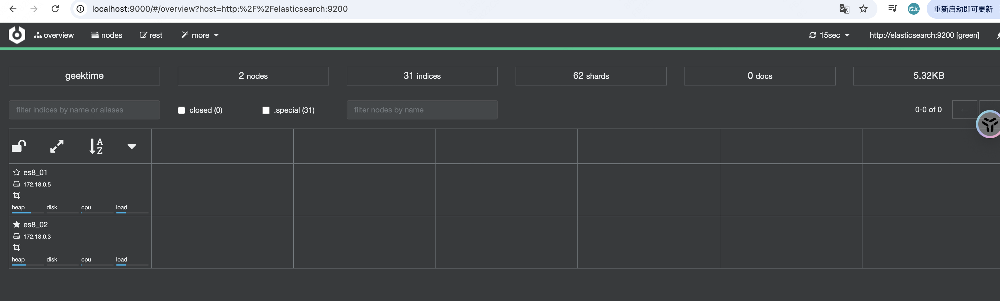

# 快速安装

## 一、Docker 安装

使用 docker-compose 一键安装 Elasticsearch、Kibana、Cerebro

```dockerfile
version: '2.2'
services:
  cerebro:
    image: lmenezes/cerebro:0.8.3
    container_name: cerebro
    ports:
      - "9000:9000"
    command:
      - -Dhosts.0.host=http://elasticsearch:9200
    networks:
      - es8net
  kibana:
    image: docker.elastic.co/kibana/kibana:8.18.0
    container_name: kibana8
    environment:
      - I18N_LOCALE=zh-CN
      - XPACK_GRAPH_ENABLED=true
      - TIMELION_ENABLED=true
      - XPACK_MONITORING_COLLECTION_ENABLED="true"
      - XPACK_ENCRYPTEDSAVEDOBJECTS_ENCRYPTIONKEY=c69548d9027afcf4d55146b1d425a9f4c69548d9027afcf4d55146b1d425a9f4
    ports:
      - "5601:5601"
    networks:
      - es8net

  elasticsearch:
    image: docker.elastic.co/elasticsearch/elasticsearch:8.18.0
    container_name: es8_01
    environment:
      - cluster.name=geektime
      - node.name=es8_01
      - bootstrap.memory_lock=true
      - "ES_JAVA_OPTS=-Xms512m -Xmx512m"
      - discovery.seed_hosts=es8_01,es8_02
      - cluster.initial_master_nodes=es8_01,es8_02
      - "xpack.security.enabled=false"
    ulimits:
      memlock:
        soft: -1
        hard: -1
    volumes:
      - es8data1:/usr/share/elasticsearch/data
    ports:
      - 9200:9200
    networks:
      - es8net
  elasticsearch2:
    image: docker.elastic.co/elasticsearch/elasticsearch:8.18.0
    container_name: es8_02
    environment:
      - cluster.name=geektime
      - node.name=es8_02
      - bootstrap.memory_lock=true
      - "ES_JAVA_OPTS=-Xms512m -Xmx512m"
      - discovery.seed_hosts=es8_01,es8_02
      - cluster.initial_master_nodes=es8_01,es8_02
      - "xpack.security.enabled=false"
    ulimits:
      memlock:
        soft: -1
        hard: -1
    volumes:
      - es8data2:/usr/share/elasticsearch/data
    networks:
      - es8net


volumes:
  es8data1:
    driver: local
  es8data2:
    driver: local

networks:
  es8net:
    driver: bridge
```

上面是配置文件，我们通过 docker 命令进行安装:

```shell
> docker-compose up
```


## 二、验证安装成功

### 2.1、Elasticsearch


### 2.2、Kibana


### 2.3、Cerebro



## 三、导入测试数据

下载 logstash ，版本与 Elasticsearch 保持一致，我们这里使用 8.18.0 版本

```shell
> sudo ./bin/logstash -f logstash.conf
```

Logstash.conf 配置内容如下：

```conf
input {
  file {
    path => ".../movies.csv"
    start_position => "beginning"
    sincedb_path => "/dev/null"
  }
}
filter {
  csv {
    separator => ","
    columns => ["id","content","genre"]
  }

  mutate {
    split => { "genre" => "|" }
    remove_field => ["path", "host","@timestamp","message"]
  }

  mutate {

    split => ["content", "("]
    add_field => { "title" => "%{[content][0]}"}
    add_field => { "year" => "%{[content][1]}"}
  }

  mutate {
    convert => {
      "year" => "integer"
    }
    strip => ["title"]
    remove_field => ["path", "host","@timestamp","message","content"]
  }

}
output {
   elasticsearch {
     hosts => "http://localhost:9200"
     index => "movies"
     document_id => "%{id}"
   }
  stdout {}
}
```

可以看到有索引已经被创建，并导入了9743条数据


