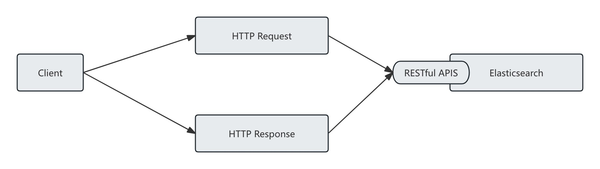
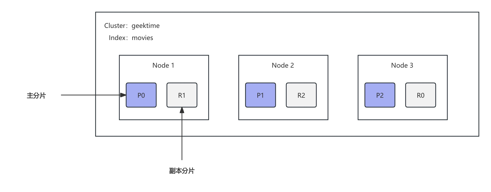

# 基础概念

##  一、索引

### 1.1、什么是索引

Index - 索引是文档的容器，是一类文档的集合

- Index(索引) 体现了逻辑空间的概念：每个索引都有自己的 Mapping 定义，用于定义包含的文档的字段名和字段类型
- Shard(分片) 体现了物理空间的概念：索引中的数据分散在 Shard 上

### 1.2、索引的 Mapping 与 Settings

- Mapping 定义文档字段的类型
- Setting 定义不同数据的分布

### 1.3、索引的不同语意

- 在 ES 中
  - 名词：一个 ElasticSearch 集群中可以创建不同的索引
  - 动词：创建一个文档到 ElasticSearch 的过程也称为索引
- 通用的索引概念
  - 为加速检索数据库中的数据而构建的一种数据结构

## 二、文档

### 2.1、什么是文档

- Elasticsearch 是面向文档的，文档是所有可搜索数据的最小单位
  - 日志文件的日志项
  - 一本电影的具体信息 / 一张唱片的详细信息
  - MP3 播放器里的一首歌 / 一篇 PDF 文档中的具体内容
- 文档会被序列化为 JSON 格式，保存在 Elasticsearch 中
  - JSON 对象有字段组成
  - 每个字段都有对应的字段类型（字符串 / 数值 / 布尔 / 日期 / 二进制 / 范围类型）
  - 选择 JSON 的原因：
    - 格式灵活、不需要预先定义格式
    - 字段的类型可以指定或者通过 Elasticsearch 自动推算
    - 支持数组 / 支持嵌套
- 每个文档都有一个 Unique ID
  - 你可以自己指定 ID
  - 或者通过 Elasticsearch 自动生成

### 2.2、文档的元数据

元数据，即描述信息的信息，这里用于标注文档的相关信息

- _index : 文档所属的索引名
- ~~_type : 文档所属的类型名（es 在7.0 之前，一个 Index 可以设置多个 Type，7.0 开始一个 Index 只能创建一个 Type : "\_doc"）~~
- _id : 文档唯一 ID
- _version : 文档的版本信息，用于**并发控制**和**乐观锁**
- _seq_no : 该文档在主分片中的**顺序编号**,用于**内部的变更排序、冲突检测、复制一致性控制**
- _primary_term : 主分片任期编号，每当主分片重启、重新选举、发生故障转移时，`_primary_term` 会递增。配合 `_seq_no` 一起用于乐观并发控制。
- found : 说明 ES 成功找到了 ID 为 `xxx` 的文档。
- _source : 文档的原始 JSON 数据
- _score : 相关性打分

### 2.3、抽象与类比

传统关系型数据库与 Elasticsearch 的区别

| RDBMS  | Elasticsearch |
| ------ | ------------- |
| Table  | Index         |
| Row    | Document      |
| Column | Field         |
| Schema | Mapping       |
| SQL    | DSL           |

## 三、RESTful API

采用 HTTP 请求响应模式，可以很容易被各种语言调用



## 四、分布式

### 4.1、分布式系统

- 高可用性
  - 服务可用性，即允许有节点停止服务
  - 数据可用性，即部分节点丢失，不会丢失数据
- 可扩展性
  - 请求量提升 / 数据的不断增长（将数据分布到所有节点上）

### 4.2、 Elasticsearch 的分布式特性

- Elasticsearch 的分布式架构
  - 不同的集群通过不同的名字来区分，默认名字 "Elasticsearch"
  - 通过配置文件修改，或者在命令行中 -E cluster.name=xxx 进行设定
  - 一个集群可以有一个或者多个节点

## 五、节点

### 5.1、节点

节点就是一个 Elasticsearch 实例

- 本质上就是一个 Java 进程
- 一台机器上可以运行多个 Elasticsearch 进程，但是生产环境一般建议一台机器上只运行一个 Elasticsearch 实例

每个节点都有名字，通过配置文件配置，或者启动的时候通过 -E node.name=node1 指定

每个节点在启动之后，会分配一个 UID，保存在 data 目录下

### 5.2、Master-eligible nodes 和 Master Node

- 每个节点启动后，默认就是一个 Master eligible 节点
  - 可以设置 node.master: false 禁止


- Master-eligible 节点可以参加选主流程，成为 master 节点

- 每当一个节点启动的时候，它会将自己选举成 Master 节点
- 每个节点上都保存了集群的状态，只有 Master 节点才能修改集群的状态信息
  - 集群状态（Cluster State），维护了一个集群中必要的信息
    - 所有的节点信息
    - 所有的索引和其相关的 Mapping 与 Setting 信息
    - 分片的路由信息
  - 【为什么只有 Master 节点可以修改】任意节点都能修改信息会导致数据的不一致性

### 5.3、Data Node 与 Coordinating Node

- Data Node
  - 可以保存数据的节点，叫做 Data Node。负责保存分片数据。在数据扩展上起到了至关重要的作用
- Coordinating Node
  - 负责接受 Client 的请求，将请求分发到合适的节点，最终把结果汇集到一起
  - 每个节点默认都起到了 Coordinating Node 的职责

### 5.4、其他的节点类型

- Hot & Warm Node
  - 不同硬件配置的 Data Node，用来实现 Hot & Warm 架构，降低集群部署的成本
- Machine Learning Node
  - 负责跑 机器学习的 Job，用来做异常检测
- Tribe Node
  - （5.3 开始使用 Cross Cluster Search）Tribe Node 连接到不同的 Elasticsearch 集群，并且支持将这些集群当成一个单独的集群处理

### 5.5、配置节点类型

- 开发环境中一个节点可以承担多种角色
- 生产环境中，应该设置单一的角色的节点（dedicated node）

| 节点类型                                   | 配置参数    | 默认值                                                       |
| ------------------------------------------ | ----------- | ------------------------------------------------------------ |
| master eligible                            | node.master | true                                                         |
| data                                       | node.data   | true                                                         |
| ingest<br />(专门用于预处理文档的节点类型) | node.ingest | true                                                         |
| coordinating only                          | 无          | 每个节点默认都是 coordinating 节点。设置其他类型全部为 false |
| machine learning                           | node.ml     | true(需要 enable x-pack)                                     |

## 六、集群

**Elasticsearch 集群**就是由多个节点（Node）组成的一个“统一整体”，它们协同工作，共同完成数据的存储、检索和处理任务。

可以简单理解成：

> 🚀 **一个 Elasticsearch 集群 = 一台超大号的虚拟搜索引擎，由很多机器（节点）组成，共同存一堆数据，对外表现得像一个整体。**

### 6.1、一个集群是如何运作的？

### 举个例子：

你有一个 3 节点的集群：

- 节点 A：主节点 + 数据节点
- 节点 B：数据节点
- 节点 C：Ingest + 协调节点

你创建了一个索引 `movies`，设置为 3 个主分片、1 个副本。

分片会分布如下：

- 分片 0 主：节点 A，副本：节点 B
- 分片 1 主：节点 B，副本：节点 A
- 分片 2 主：节点 A，副本：节点 B

客户端发送搜索请求到节点 C，节点 C 会：

1. 作为协调节点，分析请求。
2. 向 A 和 B 分发任务。
3. 收集所有分片结果，聚合排序。
4. 返回完整结果给客户端。

### 6.2、集群的健康状况

> GET _cluster/health

```json
{
  "cluster_name": "geektime",
  "status": "green",
  "timed_out": false,
  "number_of_nodes": 2,
  "number_of_data_nodes": 2,
  "active_primary_shards": 34,
  "active_shards": 68,
  "relocating_shards": 0,
  "initializing_shards": 0,
  "unassigned_shards": 0,
  "unassigned_primary_shards": 0,
  "delayed_unassigned_shards": 0,
  "number_of_pending_tasks": 0,
  "number_of_in_flight_fetch": 0,
  "task_max_waiting_in_queue_millis": 0,
  "active_shards_percent_as_number": 100
}
```

- Green: 主分片与副本分片都正常分配
- Yellow: 主分片全部正常分配，有副本分片未能正常分配
- Red: 有主分片未能分配
  - 例如，当服务器的磁盘容量超过 85%时，去创建了一个新的索引

## 七、分片（Primary Shard & Replica Shard）

### 7.1、概念

**主分片** 用以解决数据水平扩展的问题。通过主分片，可以将数据分布到集群内的所有节点之上

- 一个分片是一个运行的 Lucene 的实例
- 主分片数在索引创建时指定，后续不允许修改，除非 Reindex

**副本** 用以解决数据高可用的问题。副本分片是主分片的拷贝

- 副本分片数，可以动态调整
- 增加副本数，还可以在一定程度上提高服务的可用性（读取的吞吐）

一个三节点的集群中，movies 索引的分片情况：

```http
PUT /movies
{
	"settings":{
		"number_of_shards": 3,
		"number_of_replicas": 1
	}
}
```




### 7.2、分片的设定

对于生产环境分片的设定，需要提前做好容量规划

- 分片数设置过小
  - 导致后续无法增加节点实现水平扩展
  - 单个分片的数据量太大，导致数据重新分配耗时
- 分片数设置过大，7.0 开始，默认主分片设置成1，解决了 over-sharding 的问题
  - 影响搜索结果的相关性打分，影响统计结果的准确性（todo 这里需要了解下相关性打分再来这里解释这个结论）
  - 单个分片上过多的分片，会导致资源浪费，同时也会影响性能


