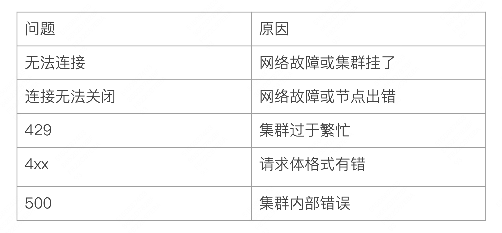

# 文档的基本 CRUD 与批量操作（读取 & Bulk API）

## 一、RESTful API

### 1.1、文档的 CRUD

#### 1.1.1、Create 文档

> - 支持自动生成文档 ID 和 指定文档 ID 两种方式
> - 通过调用 "POST my_index/_doc"，系统会自动生成 document id
> - 使用 HTTP PUT my_index/_create/2 创建时，此时如果该 id 的文档已经存在，操作则会失败

- 方式一：通过 POST API

```shell
POST my_index/_doc
{
    "username":"markuszhang",
    "age": 26,
    "motto":"No step, no mile."
}
```

返回

```java
{
  "_index": "my_index",
  "_id": "RQPQmpYBFfcCOwm56tkz", // 系统自动生成 id
  "_version": 1,
  "result": "created",
  "_shards": {
    "total": 2,
    "successful": 2,
    "failed": 0
  },
  "_seq_no": 3,
  "_primary_term": 1
}
```

- 方式二：通过 PUT API

```shell
 PUT my_index/_create/2
{
    "username":"markus zhang",
    "age": 26,
    "motto":"No step, no mile."
}
```

返回

```json
{
  "_index": "my_index",
  "_id": "2", // 返回指定的 id
  "_version": 1,
  "result": "created",
  "_shards": {
    "total": 2,
    "successful": 2,
    "failed": 0
  },
  "_seq_no": 2,
  "_primary_term": 1
}
```

如果 PUT 一个已经存在的文档 id，则会失败，我们重复执行上面的 API，返回结果如下：

```json
{
  "error": {
    "root_cause": [
      {
        "type": "version_conflict_engine_exception",
        "reason": "[2]: version conflict, document already exists (current version [1])",
        "index_uuid": "yKGlngcKTtKdC5Ii8ScLRw",
        "shard": "0",
        "index": "my_index"
      }
    ],
    "type": "version_conflict_engine_exception",
    "reason": "[2]: version conflict, document already exists (current version [1])",
    "index_uuid": "yKGlngcKTtKdC5Ii8ScLRw",
    "shard": "0",
    "index": "my_index"
  },
  "status": 409
}
```

#### 1.1.2、Get 文档

> - 找到文档，返回 HTTP 200
>   - 文档元信息
>     - _index: 文档所属的索引名称(数据存储的逻辑分区)
>     - _id: 文档的唯一标识符(支持用户自定义或自动生成)
>     - _version: 文档版本号(每次更新自动 +1 )，用于实现乐观锁控制(并发修改检测)
>     - _seq_no: 序列号(全局递增)，用于保证分片内操作的顺序性
>     - _primary_term: 主分片任期号，当主分片发生切换时递增
>     - found: 文档是否存在标识，true 表示成功找到文档，false 表示文档不存在或已被删除
>     - _source: 文档原始数据(存储时保留完整的 JSON 内容)，可通过该字段参数控制是否返回，默认开启
> - 找不到文档，返回 HTTP 404

```shell
# get 一个文档
GET my_index/_doc/1
```

返回

```json
{
  "_index": "my_index",
  "_id": "1",
  "_version": 1,
  "_seq_no": 0,
  "_primary_term": 1,
  "found": true,
  "_source": {
    "username": "markuszhang",
    "age": 26,
    "motto": "No step, no mile."
  }
}
```

当我们执行一个不存在 id 查询，则返回

```json
{
  "_index": "my_index",
  "_id": "3",
  "found": false
}
```

#### 1.1.3、Index 文档

> - Index 和 Create 不一样的地方：
>   - 如果文档不存在，就索引新的文档
>   - 否则，现有文档会被删除，新的文档被索引。版本信息 +1 

```shell
# 索引一个文档
PUT my_index/_doc/1
{
    "username":"markuszhang",
    "age": 26,
    "motto":"No step, no mile."
}
```

返回

```json
{
  "_index": "my_index",
  "_id": "1",
  "_version": 1,
  "result": "created",
  "_shards": {
    "total": 2,
    "successful": 1,
    "failed": 0
  },
  "_seq_no": 0,
  "_primary_term": 1
}
```

当我们指定 id 为 1 再次执行时，返回如下：

```json
{
  "_index": "my_index",
  "_id": "1",
  "_version": 2,			 // 版本 +1
  "result": "updated", // 更新
  "_shards": {
    "total": 2,
    "successful": 2,
    "failed": 0
  },
  "_seq_no": 4,
  "_primary_term": 1
}
```

#### 1.1.4、 Update 文档

> - Update 文档不会删除原来的文档，而是实现真正的数据更新
> - POST 方法 /Payload 需要包含在 "doc" 中

```shell
POST my_index/_update/1
{
  "doc": {
    "username": "markuszhang1",
    "age": 26,
    "motto": "No step, no mile."
  }
}
```

返回

```json
{
  "_index": "my_index",
  "_id": "1",
  "_version": 3,
  "result": "updated",
  "_shards": {
    "total": 2,
    "successful": 2,
    "failed": 0
  },
  "_seq_no": 5,
  "_primary_term": 1
}
```

### 1.2、Bulk API

> - 支持在一次 API 调用中，对不同的索引进行操作
> - 支持四种类型操作
>   - Index
>   - Create
>   - Update
>   - Delete
> - 可以在 URI 中指定 Index，也可以在请求中的 Payload 中进行
> - 操作中单挑操作失败，并不会影响其他操作
> - 返回结果包括了每一条操作执行的结果

Bulk API 操作

```shell
POST _bulk
{
  "index": {
    "_index": "test",
    "_id": 1
  }
}
{
  "field1": "value1"
}
{
  "delete": {
    "_index": "test",
    "_id": 1
  }
}
{
  "create": {
    "_index": "test",
    "_id": 2
  }
}
{
  "field2": "value2"
}
{
  "update": {
    "_index": "test",
    "_id": 2
  }
}
{
  "doc": {
    "field2": "updateValue2"
  }
}
```

返回

```json
{
  "errors": false,
  "took": 0,
  "items": [
    {
      "index": {
        "_index": "test",
        "_id": "1",
        "_version": 1,
        "result": "created",
        "_shards": {
          "total": 2,
          "successful": 2,
          "failed": 0
        },
        "_seq_no": 0,
        "_primary_term": 1,
        "status": 201
      }
    },
    {
      "delete": {
        "_index": "test",
        "_id": "1",
        "_version": 2,
        "result": "deleted",
        "_shards": {
          "total": 2,
          "successful": 2,
          "failed": 0
        },
        "_seq_no": 1,
        "_primary_term": 1,
        "status": 200
      }
    },
    {
      "create": {
        "_index": "test",
        "_id": "2",
        "_version": 1,
        "result": "created",
        "_shards": {
          "total": 2,
          "successful": 2,
          "failed": 0
        },
        "_seq_no": 2,
        "_primary_term": 1,
        "status": 201
      }
    },
    {
      "update": {
        "_index": "test",
        "_id": "2",
        "_version": 2,
        "result": "updated",
        "_shards": {
          "total": 2,
          "successful": 2,
          "failed": 0
        },
        "_seq_no": 3,
        "_primary_term": 1,
        "status": 200
      }
    }
  ]
}
```

### 1.3、批量读取 - mget

> 批量操作，可以减少网络连接所产生的开销，提高性能

```shell
# 批量读取
GET _mget
{
  "docs":[
    {
      "_index": "movies",
      "_id": 153
    },
    {
      "_index": "my_index",
      "_id": 2
    }
  ]
}
```

返回

```json
{
  "docs": [
    {
      "_index": "movies",
      "_id": "153",
      "_version": 1,
      "_seq_no": 69,
      "_primary_term": 1,
      "found": true,
      "_source": {
        "id": "153",
        "year": 1995,
        "log": {
          "file": {
            "path": "/Users/zhangchenglong06/personal/geektime/geektime-ELK/part-1/2.4-Logstash安装与导入数据/movielens/ml-latest-small/movies.csv"
          }
        },
        "title": "Batman Forever",
        "@version": "1",
        "event": {
          "original": """153,Batman Forever (1995),Action|Adventure|Comedy|Crime
"""
        },
        "genre": [
          "Action",
          "Adventure",
          "Comedy",
          "Crime"
        ]
      }
    },
    {
      "_index": "my_index",
      "_id": "2",
      "_version": 1,
      "_seq_no": 2,
      "_primary_term": 1,
      "found": true,
      "_source": {
        "username": "markus zhang",
        "age": 26,
        "motto": "No step, no mile."
      }
    }
  ]
}
```

### 1.4、批量查询 - msearch

```shell
# 批量查询
POST movies/_msearch
{}
{
  "query": {
    "match_all": {}
  },
  "from": 0,
  "size": 2
}
{
  "index": "my_index"
}
{
  "query": {
    "match_all": {}
  }
}
```

返回

```json
{
  "took": 4,
  "responses": [
    {
      "took": 2,
      "timed_out": false,
      "_shards": {
        "total": 1,
        "successful": 1,
        "skipped": 0,
        "failed": 0
      },
      "hits": {
        "total": {
          "value": 9743,
          "relation": "eq"
        },
        "max_score": 1,
        "hits": [
          {
            "_index": "movies",
            "_id": "153",
            "_score": 1,
            "_source": {
              "id": "153",
              "year": 1995,
              "log": {
                "file": {
                  "path": "/Users/zhangchenglong06/personal/geektime/geektime-ELK/part-1/2.4-Logstash安装与导入数据/movielens/ml-latest-small/movies.csv"
                }
              },
              "title": "Batman Forever",
              "@version": "1",
              "event": {
                "original": """153,Batman Forever (1995),Action|Adventure|Comedy|Crime
"""
              },
              "genre": [
                "Action",
                "Adventure",
                "Comedy",
                "Crime"
              ]
            }
          },
          {
            "_index": "movies",
            "_id": "4",
            "_score": 1,
            "_source": {
              "id": "4",
              "year": 1995,
              "log": {
                "file": {
                  "path": "/Users/zhangchenglong06/personal/geektime/geektime-ELK/part-1/2.4-Logstash安装与导入数据/movielens/ml-latest-small/movies.csv"
                }
              },
              "title": "Waiting to Exhale",
              "@version": "1",
              "event": {
                "original": """4,Waiting to Exhale (1995),Comedy|Drama|Romance
"""
              },
              "genre": [
                "Comedy",
                "Drama",
                "Romance"
              ]
            }
          }
        ]
      },
      "status": 200
    },
    {
      "took": 3,
      "timed_out": false,
      "_shards": {
        "total": 1,
        "successful": 1,
        "skipped": 0,
        "failed": 0
      },
      "hits": {
        "total": {
          "value": 4,
          "relation": "eq"
        },
        "max_score": 1,
        "hits": [
          {
            "_index": "my_index",
            "_id": "RAPKmpYBFfcCOwm5TdlD",
            "_score": 1,
            "_source": {
              "username": "markuszhang",
              "age": 26,
              "motto": "No step, no mile."
            }
          },
          {
            "_index": "my_index",
            "_id": "2",
            "_score": 1,
            "_source": {
              "username": "markus zhang",
              "age": 26,
              "motto": "No step, no mile."
            }
          },
          {
            "_index": "my_index",
            "_id": "RQPQmpYBFfcCOwm56tkz",
            "_score": 1,
            "_source": {
              "username": "markuszhang",
              "age": 26,
              "motto": "No step, no mile."
            }
          },
          {
            "_index": "my_index",
            "_id": "1",
            "_score": 1,
            "_source": {
              "username": "markuszhang1",
              "age": 26,
              "motto": "No step, no mile."
            }
          }
        ]
      },
      "status": 200
    }
  ]
}
```

### 1.5、常见的错误返回



## 二、Java API

## 三、本文总结

- 基本的文档 CRUD 操作
- 每个文档都有一个版本号，可用于并发控制避免冲突
- _mget 和 bulk API 可以减少建立网络连接所产生的开销
- bulk API 每行需要指定 index 信息，也可以在 URI 中指定。7开始，不需要指定 Type
- 单次批量操作，数据两不宜过大，以免引发性能问题