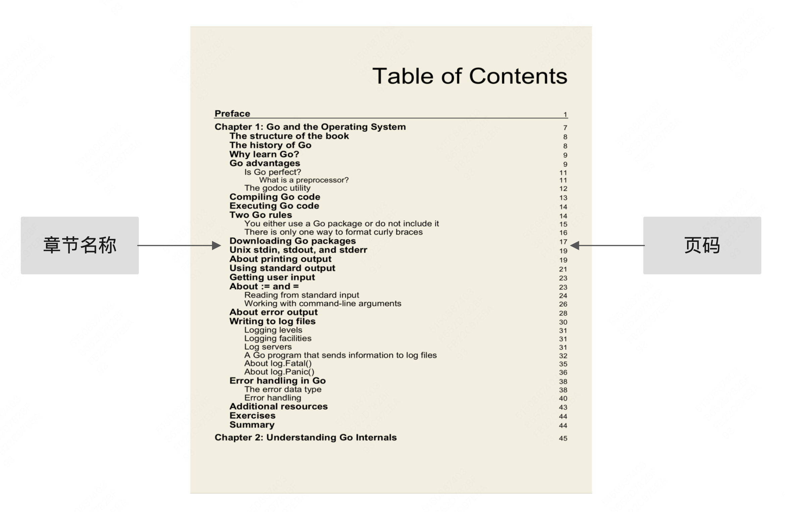
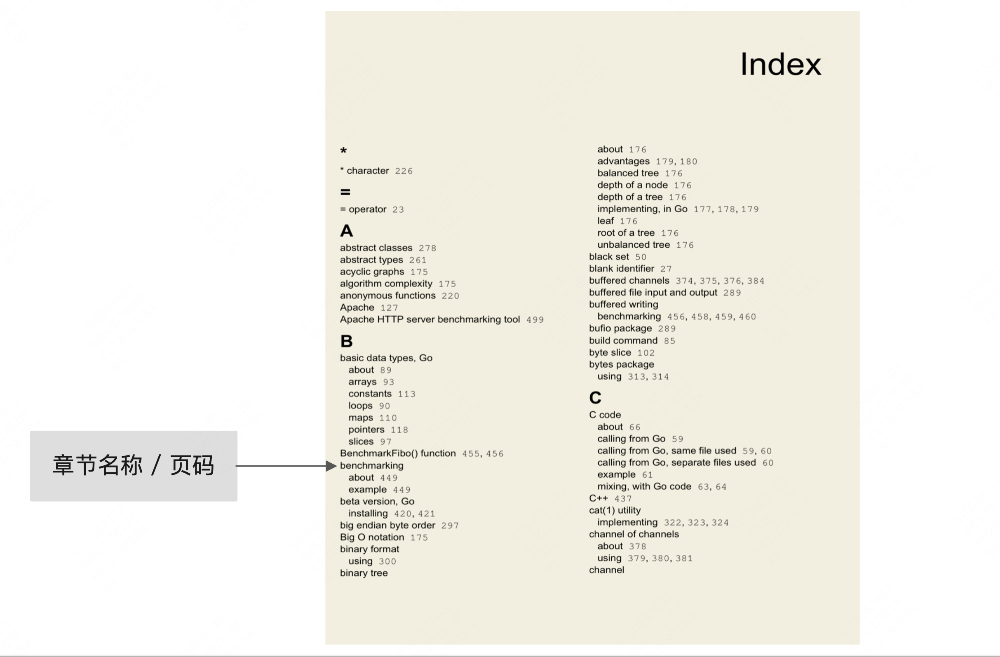
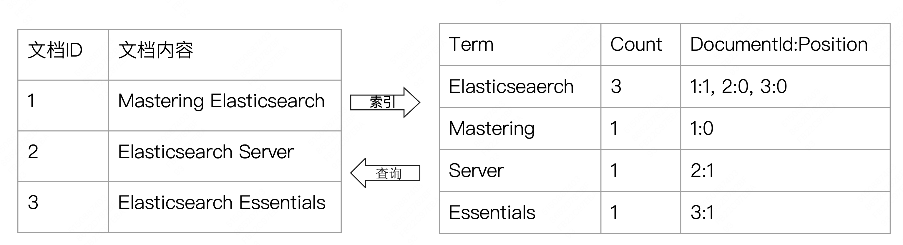
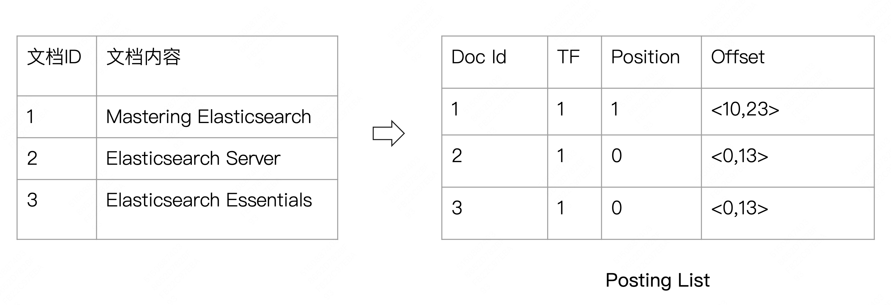

# 倒排索引入门

## 一、什么是倒排索引

### 1.1、正排索引

目录就是一个常见的正排索引应用场景



### 1.2、倒排索引

书本的末尾，通常会有一些索引页，记录关键词在文中的位置，这就是一个典型的倒排索引应用



### 1.3、图书与搜索引擎的类比

- 图书
  - 正排索引 - 目录页
  - 倒排索引 - 索引页
- 搜索引擎
  - 正排索引 - 文档 ID 到文档内容和单词的关联
  - 倒排索引 - 单词到文档 ID 的关系

### 1.4、正排索引和倒排索引



## 二、倒排索引的数据结构

### 2.1、倒排索引的核心组成

倒排索引包含两个部分：单词词典、倒排列表。

- 单词词典（Term Dictionary），记录所有文档的单词，记录单词到倒排列表的关联关系。单词词典一般比较大，可以通过 B+ 树或者哈希拉链法实现，以满足高性能的插入语查询

- 倒排列表（Posting List），记录了单词对应的文档集合，由倒排索引项组成，倒排索引项包括：

  - 文档 ID

  - 词频 TF，即该单词在文档中出现的次数，用于相关性评分

  - 位置（Position），即单词在文档中分词的位置。用于语句搜索（phrase query）

    - 短语查询：当搜索 "step mile" 时，Elasticsearch 会检查 step 的位置和 mile 的位置是否连续，（即 `position(step)+1 == position(mile)`）

    - **邻近查询（Proximity Query）**：如 `"step mile"~1` 表示两个词之间最多允许间隔2个位置

    - ```shell
      # 短语查询
      POST my_index/_search
      {
        "query": {
          "match_phrase": {
            "motto": "step mile"
          }
        }
      }
      # 临近查询
      POST my_index/_search
      {
        "query": {
          "match_phrase": {
            "motto": {
              "query": "step mile",
              "slop": 1
            }
          }
        }
      }
      ```

  - 偏移（Offset），即记录单词的开始结束位置，实现高亮显示

### 2.2、一个例子 - 搜索 Elasticsearch 单词



## 三、Elasticsearch 的倒排索引

Elasticsearch 的 JSON 文档中的每个字段，都有自己的倒排索引，也可以指定对某些字段不做索引，优点是节省存储空间，缺点就是该字段无法被搜索

