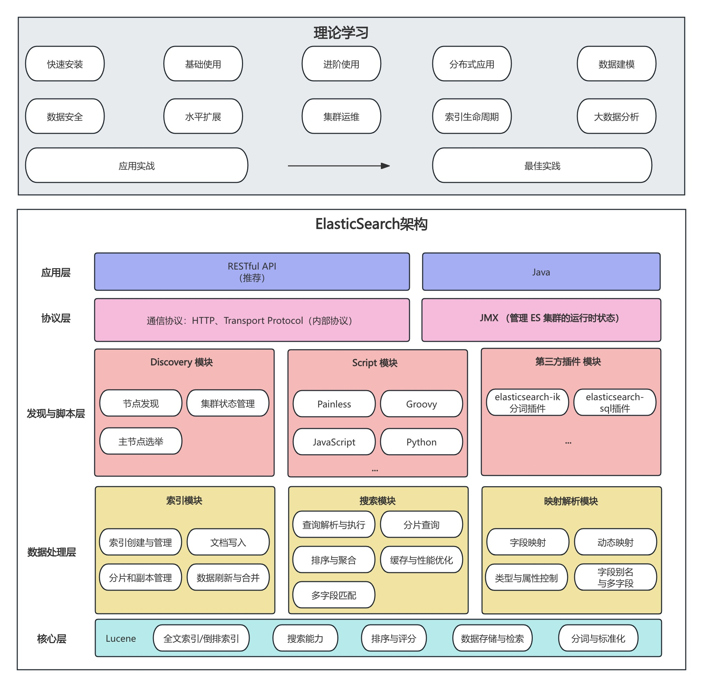

# ElasticSearch 学习规划

## 一、ElasticSearch 细节

## 二、分解行动

### 2.1 每日时间分配

7:30 起床

23:30 睡觉

- 工作日 500 分钟
  - 早晨 30 分钟 总结
  - 晚上 30 分钟 总结
  - 通勤 40 分钟 学习
- 周末 360 分钟
  - 2 小时学习
  - 4 小时总结

### 2.2 月份目标

20250420-20251020 系统掌握 ElasticSearch

【read、write】20250420-20250620 极客时间课程理论学习+总结

【write】20250621-20260720 拼好饭商品索引建设总结

【do teach】20250721-20251020 个人应用实践、总结系列内容

