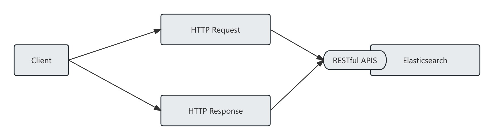

# 基础概念

##  一、索引

### 1.1、什么是索引

Index - 索引是文档的容器，是一类文档的集合

- Index(索引) 体现了逻辑空间的概念：每个索引都有自己的 Mapping 定义，用于定义包含的文档的字段名和字段类型
- Shard(分片) 体现了物理空间的概念：索引中的数据分散在 Shard 上

### 1.2、索引的 Mapping 与 Settings

- Mapping 定义文档字段的类型
- Setting 定义不同数据的分布

### 1.3、索引的不同语意

- 在 ES 中
  - 名词：一个 ElasticSearch 集群中可以创建不同的索引
  - 动词：创建一个文档到 ElasticSearch 的过程也称为索引
- 通用的索引概念
  - 为加速检索数据库中的数据而构建的一种数据结构

## 二、文档

### 2.1、什么是文档

- Elasticsearch 是面向文档的，文档是所有可搜索数据的最小单位
  - 日志文件的日志项
  - 一本电影的具体信息 / 一张唱片的详细信息
  - MP3 播放器里的一首歌 / 一篇 PDF 文档中的具体内容
- 文档会被序列化为 JSON 格式，保存在 Elasticsearch 中
  - JSON 对象有字段组成
  - 每个字段都有对应的字段类型（字符串 / 数值 / 布尔 / 日期 / 二进制 / 范围类型）
  - 选择 JSON 的原因：
    - 格式灵活、不需要预先定义格式
    - 字段的类型可以指定或者通过 Elasticsearch 自动推算
    - 支持数组 / 支持嵌套
- 每个文档都有一个 Unique ID
  - 你可以自己指定 ID
  - 或者通过 Elasticsearch 自动生成

### 2.2、文档的元数据

元数据，即描述信息的信息，这里用于标注文档的相关信息

- _index : 文档所属的索引名
- _type : 文档所属的类型名（es 在7.0 之前，一个 Index 可以设置多个 Type，7.0 开始一个 Index 只能创建一个 Type : "\_doc"）
- _id : 文档唯一 ID
- _source : 文档的原始 JSON 数据
- _all : 整合所有字段内容到该字段，已被废除
- _version : 文档的版本信息
- _score : 相关性打分

### 2.3、抽象与类比

传统关系型数据库与 Elasticsearch 的区别

| RDBMS  | Elasticsearch |
| ------ | ------------- |
| Table  | Index         |
| Row    | Document      |
| Column | Field         |
| Schema | Mapping       |
| SQL    | DSL           |

## 三、RESTful API

采用 HTTP 请求响应模式，可以很容易被各种语言调用

## 四、分布式

### 4.1、分布式系统

- 高可用性
  - 服务可用性，即允许有节点停止服务
  - 数据可用性，即部分节点丢失，不会丢失数据
- 可扩展性
  - 请求量提升 / 数据的不断增长（将数据分布到所有节点上）

### 4.2、 Elasticsearch 的分布式特性

- Elasticsearch 的分布式架构
  - 不同的集群通过不同的名字来区分，默认名字 "Elasticsearch"
  - 通过配置文件修改，或者在命令行中 -E cluster.name=xxx 进行设定
  - 一个集群可以有一个或者多个节点

## 五、节点

### 5.1 节点

节点就是一个 Elasticsearch 实例

- 本质上就是一个 Java 进程
- 一台机器上可以运行多个 Elasticsearch 进程，但是生产环境一般建议一台机器上只运行一个 Elasticsearch 实例

每个节点都有名字，通过配置文件配置，或者启动的时候通过 -E node.name=node1 指定

每个节点在启动之后，会分配一个 UID，保存在 data 目录下

### 5.2 Master-eligible nodes 和 Master Node

每个节点启动后，默认就是一个 Master eligible 节点

## 五、集群

## 六、分片

## 七、副本

